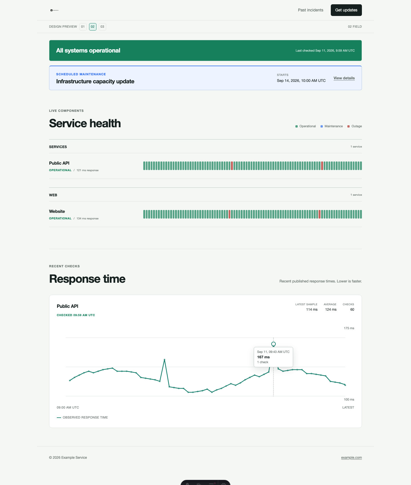
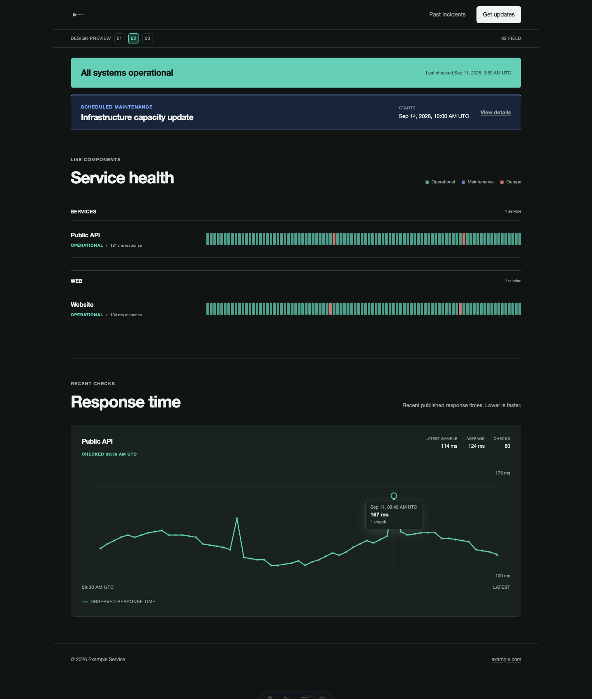

# Visual review

This page shows the default example site. Every deployment supplies its own name, component groups, services, links, colors, and identity assets through `status.config.json`. The screenshots contain generated example data and are not evidence of live uptime.

## Light theme



## Dark theme



## What visitors see

- A single current-state banner with the latest confirmed check time.
- Exactly three public status categories: Operational, Maintenance, and Outage.
- Ninety days of history for each component.
- Response-time charts with exact per-observation details on hover, tap, or keyboard focus.
- Dedicated incident and maintenance history pages.
- A subscription action only when the site has a complete delivery configuration.

Missing or delayed monitoring data is shown neutrally. It is never converted to an operational claim.

## Review it locally

```sh
bun install --frozen-lockfile
bun run dev
```

Open `http://localhost:4321/v/2/` for the pictured example. The routes under `/v/` exist only in example mode and are excluded from production builds.

Review the page at desktop and mobile widths, in both themes, and with reduced motion enabled. Check that:

- The banner, maintenance row, service history, and latency cards share one content gutter.
- Operational, maintenance, and outage remain distinguishable without relying on color alone.
- Long service names wrap without horizontal scrolling.
- Keyboard focus is visible on links, buttons, the theme control, and the subscription dialog.
- Missing response-time checks remain visible gaps, and graph details stay inside the card at mobile widths.
- A stale snapshot stops claiming that systems are operational.

Use `bun run check:all` for the complete automated review across Chromium, WebKit, and the 390 px mobile viewport.
